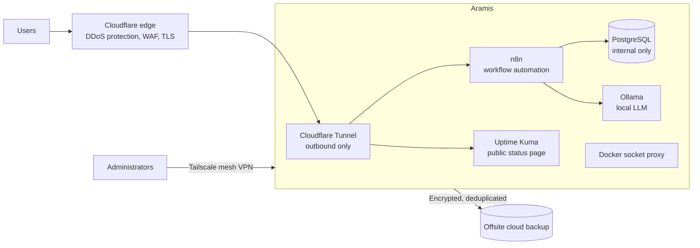

# Aramis: Project Server

A self-hosted server built for student and faculty projects at Instituto Tecnológico de Hermosillo. It runs workflow automation, a public status page, and a local AI model, built on repurposed workstation hardware with a security-first design.

## Goals

- Give students a real platform to build and showcase automation and AI projects
- Keep the server off the public internet while its services stay reachable
- Run on modest, reused hardware with zero licensing cost
- Document everything so the setup can be maintained and handed over

## Hardware

| Component | Spec |
|---|---|
| Model | Dell Precision Tower 5810 |
| CPU | Intel Xeon E5-1620 v4 (4 cores, 8 threads) |
| RAM | 16 GB ECC DDR4 |
| Storage | 232 GB NVMe |
| GPU | NVIDIA Quadro K420 (below the minimum for GPU inference, so AI runs on CPU) |
| OS | Ubuntu LTS |

## Architecture

**How traffic reaches the server**

- Public traffic never reaches the server directly. Users hit Cloudflare's edge, which forwards requests through an outbound-only tunnel.
- The server's IP address is never exposed, and no inbound ports are opened on the network.
- Administrative access goes only over a private Tailscale mesh VPN with key-based authentication.

## Services

| Service | Purpose | Exposure |
|---|---|---|
| n8n | Workflow automation for student projects | Public, behind Cloudflare |
| Uptime Kuma | Public status page for services | Public, behind Cloudflare |
| PostgreSQL | Database for n8n | Internal only |
| Ollama (Llama 3.2 3B) | Local AI model, no data leaves the server | Internal only |
| Docker socket proxy | Limits what containers can do with the Docker API | Internal only |

All services except Ollama run as Docker containers, with:

- Isolated Docker networks per service group
- CPU and memory limits on every container
- A single master compose file for predictable updates

## Security

| Layer | Tool | Role |
|---|---|---|
| Edge | Cloudflare | DDoS mitigation, bot protection, managed WAF |
| Transport | Cloudflare Tunnel | Hides the origin, no inbound exposure |
| TLS | Cloudflare | Full (strict) TLS, HSTS, TLS 1.2 minimum, HTTP/3 |
| Firewall | UFW | Default deny inbound |
| Access | OpenSSH + Tailscale | Key-only auth, no root login, no passwords |
| Brute force | Fail2ban | Bans repeated failed logins |
| Threat intel | CrowdSec | Community blocklists and behavior detection |
| Integrity | Auditd, debsums | File and package integrity monitoring |
| Visibility | Logwatch | Daily log summaries |
| Patching | Unattended Upgrades | Automatic security updates |
| Containers | Socket proxy, network isolation | Limits the blast radius of a compromised container |
| Auditing | Lynis | Monthly system hardening audit |
| Vulnerabilities | Trivy | Monthly container image scanning |

## Backups

- **Tooling:** Restic for backups, Rclone as transport to offsite cloud storage
- **Encrypted** at rest and deduplicated, so the long-term footprint stays small
- **Scope:** service configurations, application data, and system configuration. Container images are excluded because they can be pulled again.
- **Schedule:** automated daily backups with nightly pruning
- **Retention:** 7 daily, 4 weekly, 3 monthly snapshots

## Operations

A monthly maintenance cycle covers:

- Vulnerability scanning of every running container image
- Image updates, then cleanup of unused images
- A system hardening audit, tracked against a target score
- A review of threat detection metrics
- Backup verification
- A full health check script covering containers, services, public reachability, backups, and disk and memory headroom
